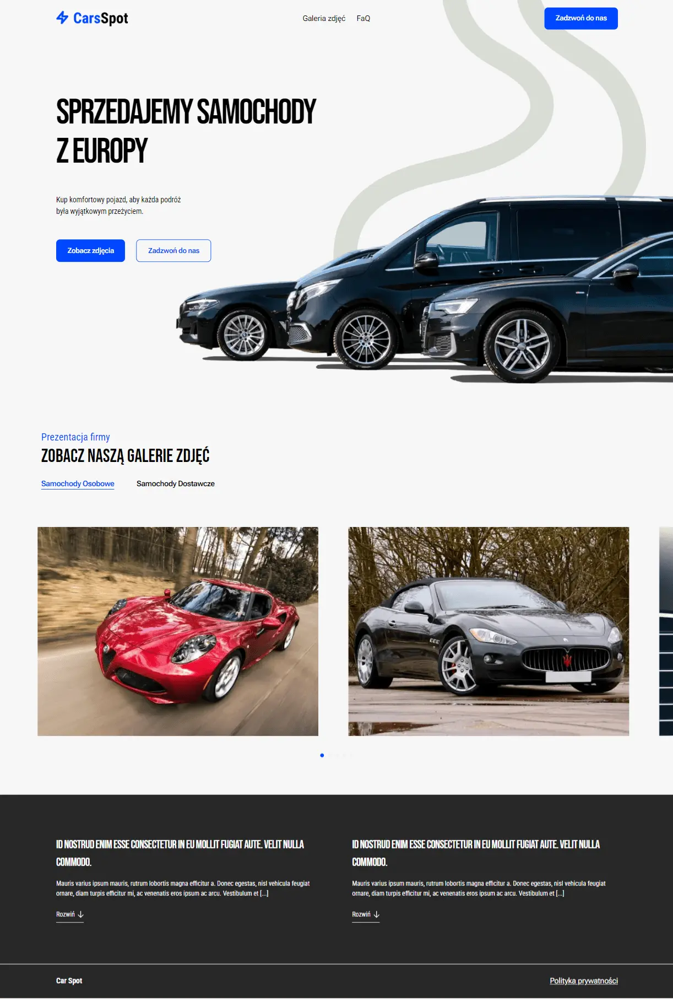
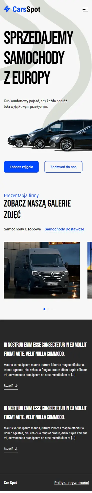

# Next.js 14 Website

Features:

- Tailwind design 
- Typescript
- SEO Friendly 
- Zustand for state management
- Framer motion
- Embla carousel react

##  [Visit project url](https://next14-website-figma-task.vercel.app/)

  

  

